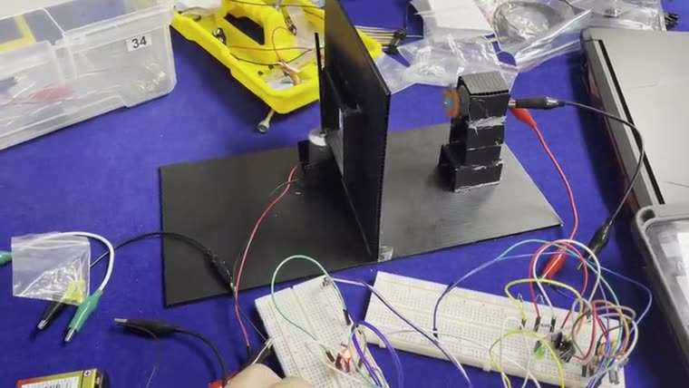

# 01076107 — Circuits And Electronics; 01076108 — Circuits And Electronics In Practice

**Archive:** `1S2/Circuit`

[All courses](../../COURSE_MAP.md) · [Semester overview](../README.md) · [Academic portfolio](https://tart-ratha-portfolio.ratha-tart.chatgpt.site/academic.html)

## What is here

MATLAB calculation and plotting scripts sit alongside an Arduino-compatible sensor-counter project with interrupt handling and debouncing.

## Visuals

The assembled lab circuit under test. The image links to a short demonstration clip.

## Skills demonstrated

**MATLAB** · **Circuit analysis** · **Plotting** · **Interrupts** · **Debouncing**

Keywords describe the preserved work, not sole authorship of team exercises or mastery of every technology.

## Start here

Inspect Matlab and Project/Project.ino. Circuit theory and practice share this archive; individual lab allocation is not recorded.

## Browse

- [List_item.txt](List_item.txt)
- [Matlab](Matlab/)
- [Project](Project/)

## Course context

Shared material for these courses; individual files are not allocated to separate course codes.

This is an academic archive, not one installable application. Check each exercise’s dependencies and hardware requirements.
