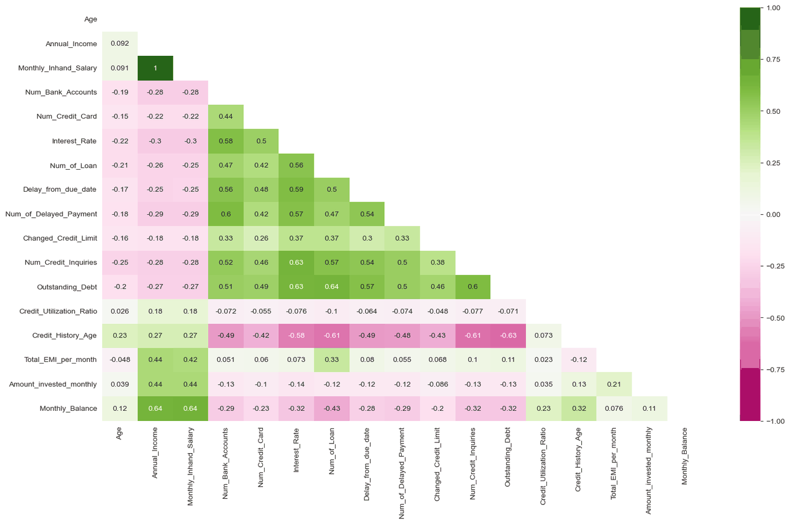
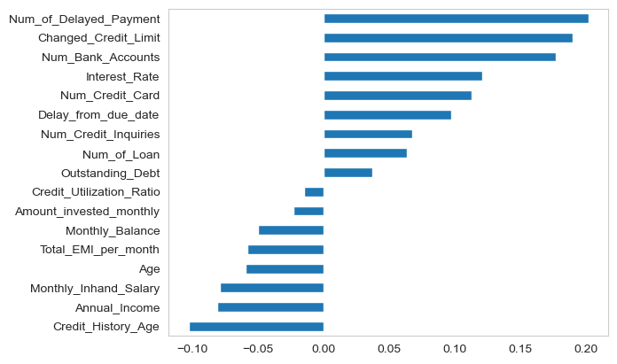
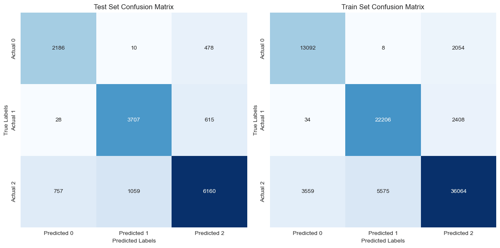

# 01076032 — Elementary Differential Equations And Linear Algebra

**Archive:** `2S1/Linear Algebra Project (Credit Score)`

[All courses](../../COURSE_MAP.md) · [Semester overview](../README.md) · [Academic portfolio](https://tart-ratha-portfolio.ratha-tart.chatgpt.site/academic.html)

## What is here

A credit-score study includes data-cleaning, model-training, GUI, and manual-test notebooks. The notebooks demonstrate a workflow from tabular data preparation to model experiments.

## Visuals

These figures are the plot outputs stored in `02_Model_Trainning.ipynb`.

Correlation across the cleaned features. Annual income and monthly in-hand salary are collinear, and the delinquency-related columns move together as a block.

Fitted coefficients ranked by weight. Delayed payments and credit-limit changes push a score down, while a longer credit history pulls it up.

Confusion matrices for the train and test splits across the three score classes.

## Skills demonstrated

**Python** · **Pandas** · **NumPy** · **Data cleaning** · **Model evaluation**

Keywords describe the preserved work, not sole authorship of team exercises or mastery of every technology.

## Start here

Start with 01_Data_Cleanning.ipynb and 02_Model_Trainning.ipynb. Required datasets are not bundled.

## Browse

- [01_Data_Cleanning.ipynb](01_Data_Cleanning.ipynb)
- [02_Model_Trainning.ipynb](02_Model_Trainning.ipynb)
- [GUI.ipynb](GUI.ipynb)
- [Manual_Test.ipynb](Manual_Test.ipynb)

## Course context

Course association follows the transcript and reviewed archive map, with owner corrections where supplied.

This is an academic archive, not one installable application. Check each exercise’s dependencies and hardware requirements.
