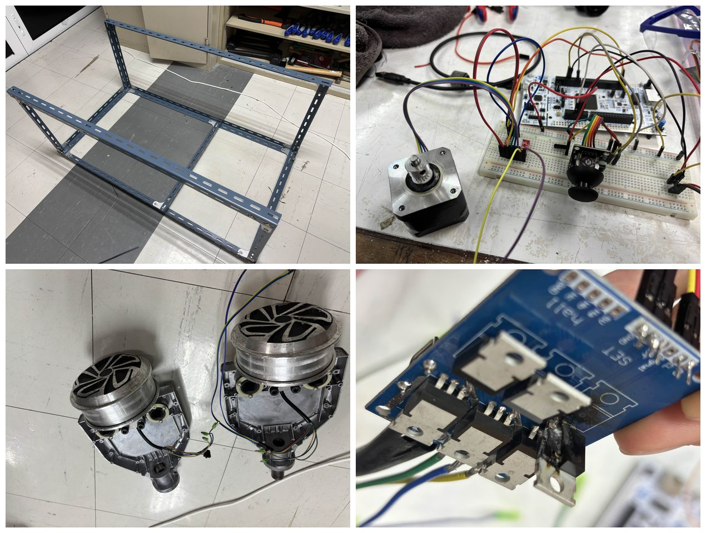
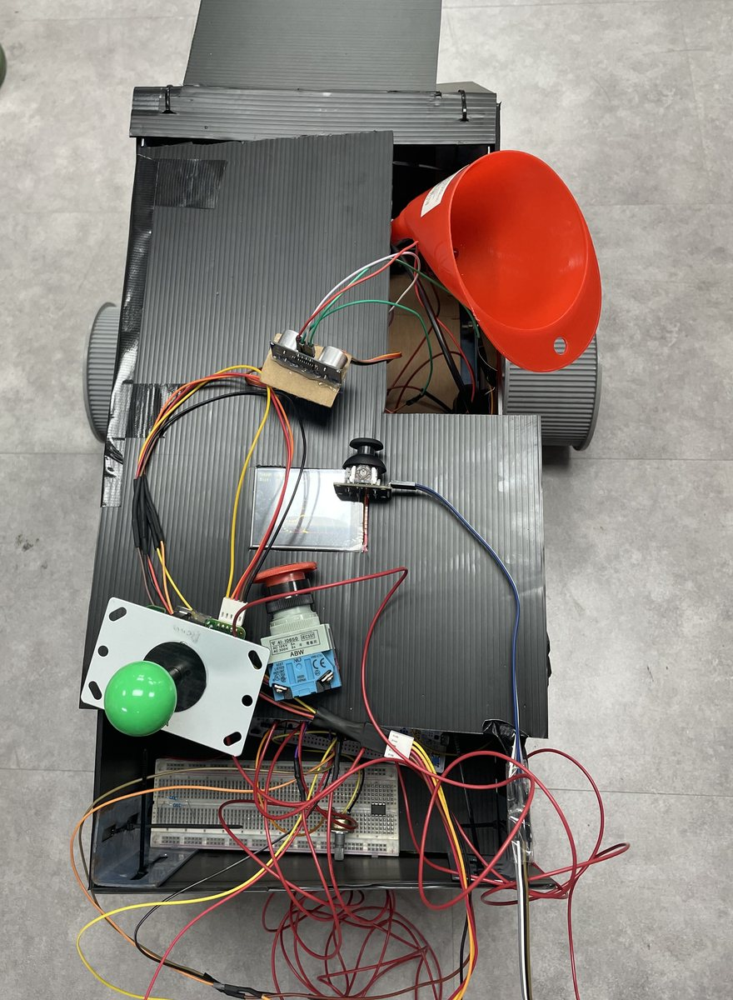

# 01076050 — Microcontroller Application And Development; 01076051 — Microcontroller Project

**Archive:** `3S1/Microcontroller`

[All courses](../../COURSE_MAP.md) · [Semester overview](../README.md) · [Academic portfolio](https://tart-ratha-portfolio.ratha-tart.chatgpt.site/academic.html)

## What is here

STM32 lab source includes initialization, GPIO, interrupt handlers, startup code, and hardware abstraction layer configuration.

## Build progress

Component work that preceded the assembled vehicle: the steel chassis, a stepper motor driven from the board with joystick input, the hub-motor wheels, and a driver board with soldered power devices.

## Result

The final project was open-ended — build anything the board can drive. The result is a wire-controlled gel-blaster tank.

It steers tank-style: the two hub motors are driven independently, so a speed difference between the sides turns the vehicle and opposing directions spin it on the spot. Control is over a tether rather than a radio link. The turret carries a motor-driven gel launcher aimed on two axes, X for traverse and Y for elevation, fed from the orange hopper. An ultrasonic sensor provides radar-style range sensing.

Looking down on the deck, the control layout is visible end to end:

| Component | Role |
|---|---|
| Hub-motor wheels | Independent left and right drive for tank steering |
| Gel hopper | Gravity feed for the projectiles |
| Launcher motor | Propels gel projectiles |
| Two-axis turret drive | Traverse on X, elevation on Y |
| Ultrasonic sensor on a card mount | Radar-style range sensing |
| Arcade joystick | Wired driving and aiming input |
| Red mushroom button | Emergency stop |
| Panel switch and contactor block | Main power switching |
| Rotary potentiometer | Analogue control input |
| Lithium battery pack | Onboard power |
| Breadboard and loom | Signal routing between the board, sensor, and drivers |

Differential drive, two-axis aiming, and ultrasonic ranging all reduce to the same primitives as the lab exercises — timer-driven motor outputs, GPIO, and interrupt-driven echo timing. These photographs record the delivered hardware; the control firmware is the STM32 source in [`Lab`](Lab/).

## Skills demonstrated

**Embedded C** · **STM32** · **HAL** · **GPIO** · **Interrupt handling**

Keywords describe the preserved work, not sole authorship of team exercises or mastery of every technology.

## Start here

Read each Lab/Core/Src/main.c with its matching headers. Hardware and toolchain configuration are required.

## Browse

- [Lab](Lab/)

## Course context

Shared material for these courses; individual files are not allocated to separate course codes.

This is an academic archive, not one installable application. Check each exercise’s dependencies and hardware requirements.
