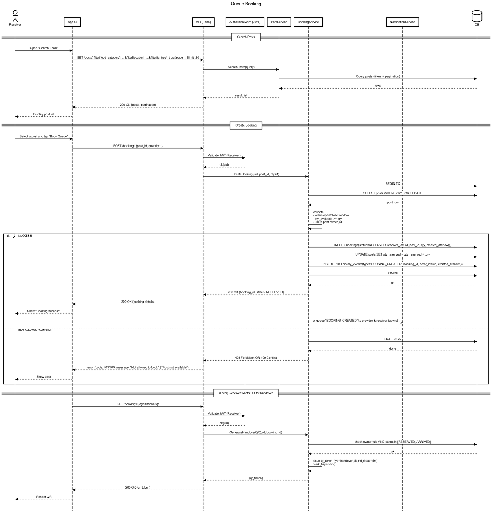
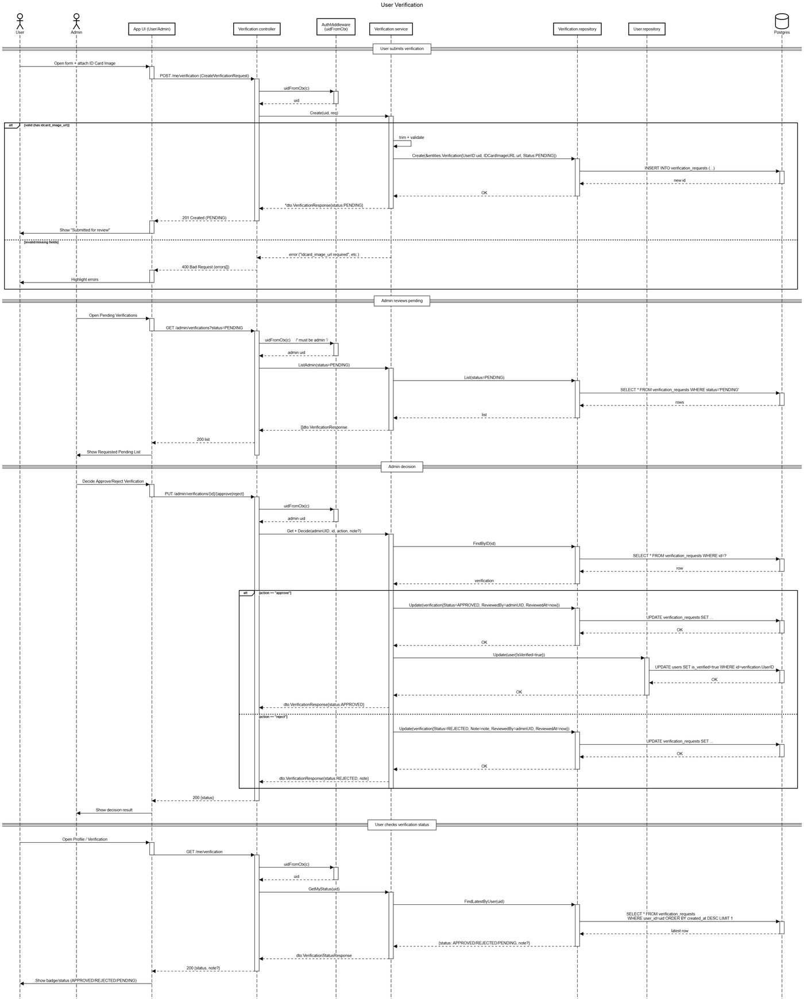

# 01076035 — Software Development Process In Practice

**Archive:** `3S1/PSPD`

[All courses](../../COURSE_MAP.md) · [Semester overview](../README.md) · [Academic portfolio](https://tart-ratha-portfolio.ratha-tart.chatgpt.site/academic.html)

## What is here

This folder contains a FoodBridge snapshot with Go feature modules, database access, authentication, Docker configuration, and relational domain models.

## Visuals

The relational model behind the Go feature modules:

Queue booking and user verification are the two flows that cross the most services, so they are the clearest illustration of how the modules interact.

The mobile screens show the donation feed, a post detail with its pickup window and location, and the saved-items view.

## Skills demonstrated

**Go** · **Echo** · **PostgreSQL** · **Backend architecture** · **Docker**

Keywords describe the preserved work, not sole authorship of team exercises or mastery of every technology.

## Start here

Open FoodBridge/README.md and main.go. Ratha confirmed FoodBridge belongs to 01076035, despite this snapshot being stored under 3S1/PSPD.

## Browse

- [FoodBridge](FoodBridge/)

## Course context

Course association follows the transcript and reviewed archive map, with owner corrections where supplied.

This is an academic archive, not one installable application. Check each exercise’s dependencies and hardware requirements.
