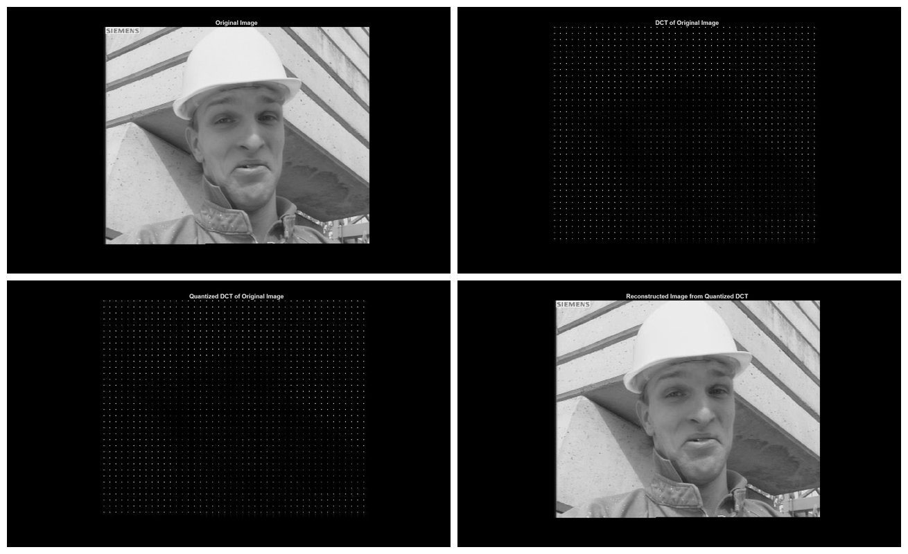

# 01076566 — Multimedia Systems

**Archive:** `3S2/Multimedia`

[All courses](../../COURSE_MAP.md) · [Semester overview](../README.md) · [Academic portfolio](https://tart-ratha-portfolio.ratha-tart.chatgpt.site/academic.html)

## What is here

MATLAB experiments cover integer and half-pixel exhaustive block matching, motion-vector visualization, DCT quantization, and video coding.

## Visuals

Exhaustive block matching estimates motion between an anchor frame and a target frame. The predicted frame and the motion field show how much of that motion the search recovered, and the block edges visible in the prediction are the artifacts the method is known for.

Quantizing the DCT coefficients leaves most of the frequency map empty while the reconstructed frame stays close to the original, which is the trade-off the coding experiments measure.

## Skills demonstrated

**MATLAB** · **Motion estimation** · **Block matching** · **DCT** · **Video processing**

Keywords describe the preserved work, not sole authorship of team exercises or mastery of every technology.

## Start here

Begin with EBMA_main.m and video_coding.m, then inspect the supporting routines. Input media is required.

## Browse

- [EBMA_half.m](EBMA_half.m)
- [EBMA_integer.m](EBMA_integer.m)
- [EBMA_main.m](EBMA_main.m)
- [plot_MV_function.m](plot_MV_function.m)
- [quan_dct.m](quan_dct.m)
- [step1_integer_16.m](step1_integer_16.m)
- [step2_half_16.m](step2_half_16.m)
- [step3_integer_8.m](step3_integer_8.m)
- [video_coding.m](video_coding.m)

## Course context

Course association follows the transcript and reviewed archive map, with owner corrections where supplied.

This is an academic archive, not one installable application. Check each exercise’s dependencies and hardware requirements.
