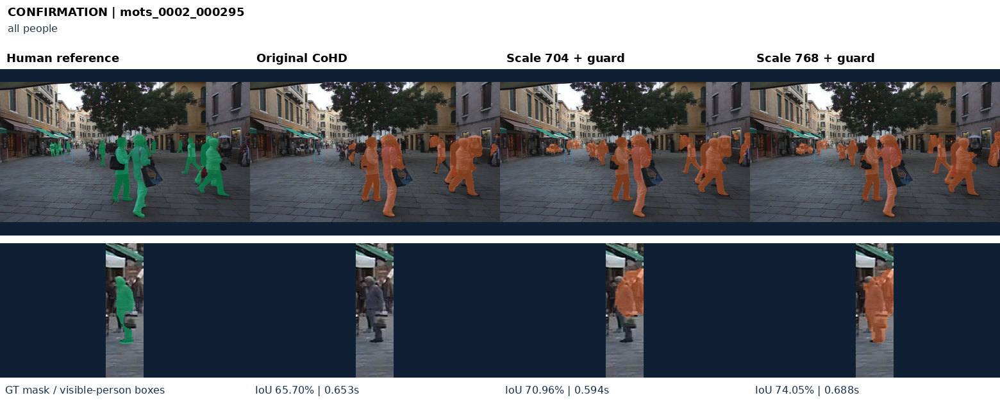
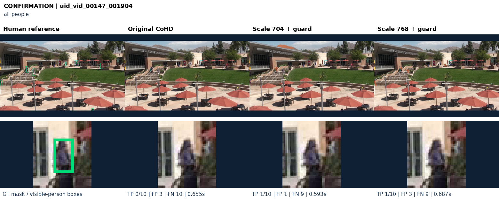
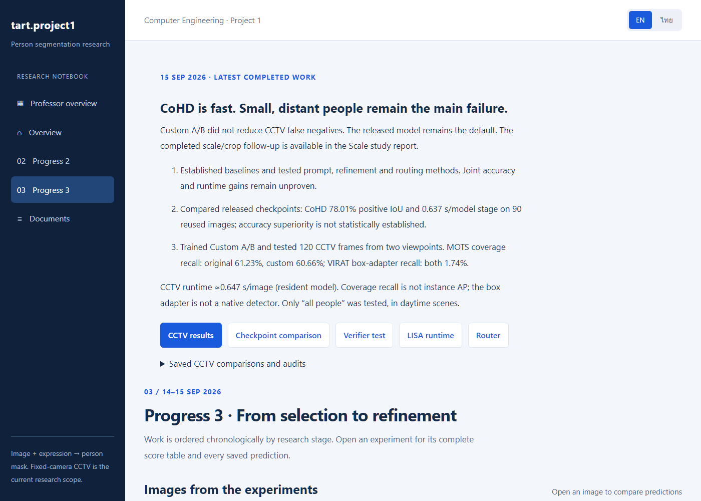

# 01076311 — Project 1

**CE69-27 · A Comparative Study and Performance Improvement of Deep Learning Models for Person Detection in Surveillance Imagery**

[All courses](../../COURSE_MAP.md) · [Semester overview](../README.md) · [Academic portfolio](https://tart-cv.ratha-tart.workers.dev/?project=surveillance)

## Research question

Can a model find the person described by a natural-language expression in a fixed-camera CCTV frame and return that person as a pixel-level mask? The evaluation also includes **no-match** queries, where the correct output is an empty mask.

This is active academic research rather than a finished product. The project compares language-guided segmentation approaches under shared datasets, prompts, metrics, and hardware records. The current study includes **LISA-7B-v1**, **SSP-SAM-224**, and **CoHD-Tiny**, plus controlled inference and verification experiments.


## Latest progress-report evidence

The latest report does more than show qualitative examples: it records benchmark slices, locked confirmation samples, failure checks, and runtime. The strongest currently accepted change is **Scale704 with a guard**, evaluated against the original CoHD setup.

| Reported check | Original | Scale704 + guard |
| --- | ---: | ---: |
| MOTS coverage recall · 120 confirmation frames | 62.39% | 77.32% |
| VIRAT matched people | 10 / 635 | 48 / 635 |
| VIRAT false-positive components | 150 | 120 |
| Mean runtime | 0.6541 s/image | 0.5934 s/image |

On a separate 90-image gRefCOCO slice, **CoHD-Tiny reached 78.01% positive-target mean IoU** and ran about **21.6× faster than LISA** in the reported setup. These measurements belong to their stated samples and hardware; they are not a general claim that one model is always superior.

### MOTS20 comparison



### VIRAT comparison



### Reviewable experiment evidence

The local research portal reads generated artifacts instead of hard-coding measurements, making results easier to inspect during report preparation.



## What is preserved here

- `docs/research-and-roadmap.md` — research framing, decisions, and next steps.
- `code/scripts/` — experiment, evaluation, and evidence-generation scripts.
- `code/webapp/` — bilingual local results browser and inference portal.
- `code/results/` — reproducible evidence when a run is committed: per-image data, summaries, masks, and visualizations.

## How to browse the work

Start with [`docs/research-and-roadmap.md`](docs/research-and-roadmap.md), then inspect [`code/scripts`](code/scripts/) and [`code/webapp`](code/webapp/). The local website can be started from the full project checkout with:

```powershell
.\start-website.ps1
```

Inference requires the project’s Python 3.11 environment, model checkpoints, datasets, and suitable hardware. See the preserved setup notes before attempting a run; this folder is a research archive, not one installable application.

## Current limitations

- The surveillance confirmation evidence currently covers **two fixed, daytime viewpoints**.
- Many distant or very small people are still missed.
- Results do not yet demonstrate performance on unseen cameras, night scenes, or broad real-world deployment.
- Team research, upstream model code, datasets, and open-source components retain their original attribution. Repository contents do not imply sole authorship of every component.

## Skills demonstrated

**PyTorch** · **Computer vision** · **Vision-language models** · **Referring segmentation** · **Evaluation protocols** · **CCTV analysis** · **Research documentation**
