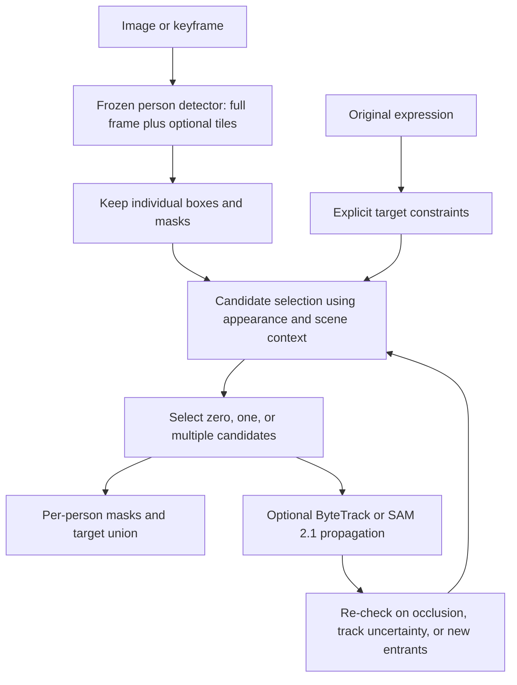

# Research roadmap: person detection in surveillance imagery

Researched 14 September 2026. Project: **A Comparative Study and Performance Improvement of Deep Learning Models for Person Detection in Surveillance Imagery**. The user confirmed **fixed-camera/CCTV** as the surveillance domain and explicitly excluded drone imagery from present and future work. Recommendations below are research decisions, not measured wins. The separate locked 60-image training-free language-component benchmark is now complete.

## Recommended direction

The most valuable improvement is to connect the existing language-guided segmentation work to actual fixed-camera surveillance conditions. Keep the current gRefCOCO person evaluation, add a segmentation test using eligible fixed-camera MOTS sequences, and use a fixed-camera detection/track test from PersonPath22 when extending to video. Test changes to candidate recall, target selection, rejection, and temporal continuity separately. Adding every available foundation model to one ensemble is unlikely to produce an interpretable or efficient project.

For the present **no additional model training** constraint, prioritize:

1. Preserve the original referring expression and individual candidate masks.
2. Test full-image plus sliced person detection for small people.
3. Add explicit no-match decisions with thresholds selected only on development data.
4. For video, select a target on a keyframe, propagate its mask/track, and re-check when evidence deteriorates.
5. Consider a released SAM 3 checkpoint as a new baseline after access and hardware compatibility are verified.

“Training-free” here means no project-specific gradient updates. All foundation models were pretrained; a released model trained by its authors can still be used with frozen weights. Scalar threshold selection is calibration and must be disclosed.

## Make the comparison match the title

| Evaluation track | Input and output | Appropriate question | Suggested data |
|---|---|---|---|
| A: all-person surveillance segmentation | Image → all visible person masks | Does the system find people in difficult surveillance scenes? | MOTS; existing camouflage data as a separate domain |
| B: language-guided person segmentation | Image + expression → zero, one, or multiple target masks | Does it select the right people and reject absent descriptions? | gRefCOCO-person; HumanRef for additional selection testing |
| C: temporal surveillance extension | Video + optional expression → persistent person tracks/masks | Does it stay on the target through occlusion and motion? | PersonPath22 for boxes/tracks; MOTS for masks; MeViS for motion language |

These tracks should have separate tables. ZoomNeXt can participate natively in image-only foreground segmentation; on language-conditioned tasks it is a vision-only control unless an explicitly named selector is added. YOLO-World needs a mask stage for segmentation comparison. A semantic union mask must not be presented as instance detection AP or identity tracking.

If the approved title is fixed, explain language-guided segmentation as a specific extension of person localization. If a revised title becomes possible, an accurate option is: **A Comparative Study and Training-Free Improvement of Person Segmentation in Surveillance Imagery Using Visual and Language Cues**. This is a proposed clarification, not a change to the submitted project title.

## Dataset shortlist and what each actually measures

| Priority | Dataset | Useful annotation/domain | Project use and limitation |
|---|---|---|---|
| Core, already in use | [gRefCOCO](https://github.com/henghuiding/gRefCOCO) | Referring expressions, instance masks, multiple and absent targets | Primary language test. COCO natural imagery is not itself a surveillance benchmark. Keep the fresh 60-image subset as a locked project test, not a full benchmark claim. |
| Core surveillance | [MOTS](https://motchallenge.net/data/MOTS/) | Pixel masks and trajectories; static and moving camera sequences | Best immediate bridge from current masks to surveillance. Eight sequences, four with training labels. Already available on our remote machine. Its sequences overlap MOT17: do not treat the two as independent image sources. |
| Strong video extension | [PersonPath22](https://amazon-science.github.io/tracking-dataset/personpath22.html) | 236 mostly static-camera videos; visible/amodal boxes, track IDs, occlusion and other tags | Stronger match to fixed CCTV than driving datasets. Use for detection/tracking; it does not supply native language expressions or segmentation masks. CC BY-NC 4.0; follow the stated restrictions on biometric identification. |
| Language stress test | [HumanRef](https://github.com/IDEA-Research/RexSeek) | 6,000 benchmark expressions across attributes, positions, interactions, reasoning, celebrity, rejection | Useful for clothing, multiple people, and no-match errors. Prioritize non-celebrity categories for this project. Its segmentation masks are SAM2-generated, so use box/selection metrics as primary and disclose mask provenance. |
| Nighttime stress test | [NightOwls](https://www.nightowls-dataset.org/about/) | Night/dawn pedestrian boxes and difficulty/occlusion metadata | Useful for real low light, glare and blur. Vehicle-mounted capture is not fixed CCTV. Native boxes, not masks or clothing descriptions. Annotation policy and ignore regions matter. |
| Dense crowd stress test | [MOT20](https://motchallenge.net/data/MOT20/) | Crowded station/square scenes, including night; boxes and tracks | Good for missed small/occluded people. Do not confuse MOT20 with MOTS20: the latter names segmentation sequences in the MOTS benchmark. |
| Occlusion diagnostic | [CrowdHuman](https://www.crowdhuman.org/) | Head, visible-person and full-body boxes; dense crowds | Useful for candidate recall and visibility strata. A box around a visible mask should not be compared silently against an amodal full-body box. No native referring masks. |
| Motion-language extension | [MeViS v2](https://github.com/henghuiding/MeViS) | Video masks, motion expressions, multi-target and no-target cases | Useful for descriptions such as “the person walking away.” Filter and audit a person subset. The public Val-u split supports offline evaluation; regular Val lacks public GT. Pin the release because v1 and v2 differ. |
| Lower priority | [BDD100K](https://bdd-data.berkeley.edu/) | Driving scenes with several detection/segmentation/tracking tasks | Useful for weather/time diversity, but adds another driving domain and substantial setup. Select the correct annotation task; labels are not identical across its subsets. |

With the confirmed CCTV scope, retain **gRefCOCO** as the language-component test, prioritize **PersonPath22** for surveillance detection/tracking, and use eligible fixed-camera **MOTS** sequences as a complementary mask benchmark. Verify camera motion before accepting a surveillance sequence. Drone datasets are excluded from the project. NightOwls and BDD100K remain literature context about low-light/domain challenges, not planned fixed-CCTV evaluation sets. Evaluate CCTV day/night conditions using eligible stationary-camera sequences instead of broadening the capture domain.

For PersonPath22, the official repository describes keyframe annotations sampled at 5 FPS. Verify timestamps and the exact annotation release before evaluating every decoded video frame. Its external sources include MEVA, VIRAT and PathTrack; some clips are crops of the same original recording. Group those shared source recordings when splitting and when checking cross-dataset independence. Do not silently interpolate new GT or count unannotated frames as empty. [Official annotation notes](https://github.com/amazon-science/tracking-dataset), [source mapping](https://github.com/amazon-science/tracking-dataset/blob/main/readme/external_dataset.md).

The MOTChallenge pages currently state that their submission/evaluation service is closed and provide an archived leaderboard and downloads. Plan reproducible evaluation on publicly available labels, with a declared project split; do not promise a new official server score. NightOwls is offered for non-commercial research/related uses. Download availability was checked at the documentation level; full archives have not been verified in this research pass. [MOTChallenge archive](https://motchallenge.net/data/MOTS/), [NightOwls terms](https://www.nightowls-dataset.org/frontpage_bottom/).

## Architecture options grounded in the literature

| Option | Mechanism | Benefit to investigate | Training-free / 8 GB assessment |
|---|---|---|---|
| Existing YOLO-World + SAM | Open-vocabulary detector supplies boxes to a mask model | Fast proposal generation, separate localization and segmentation | Already runnable serially. Full-expression detection can lose attributes; preserve individual candidates. |
| Existing LISA | Language reasoning produces segmentation-conditioned output | Strong semantic reference in our completed tests | Already runnable but about 45 seconds per new image in the current configuration. An ensemble that retains it retains this cost. |
| Existing ZoomNeXt | Multi-scale visual features for camouflage/foreground segmentation | Specialized domain evidence | Keep as a separate camouflage/all-person baseline. Adding it to a language pipeline must be justified by an ablation. |
| [SAHI](https://arxiv.org/abs/2202.06934) | Run a detector on overlapping tiles and merge predictions | Improve recall of small people that disappear during whole-image resizing | Inference-only slicing needs no retraining. Run tiles serially; more compute and duplicate/cut-person errors are expected tradeoffs. |
| [ByteTrack](https://github.com/FoundationVision/ByteTrack) | Associate high- and lower-confidence detections with existing tracks | Reduce fragmentation when a person becomes partly occluded | Association adds no newly trained weights. Its published speed is not our hardware speed. Tracking can maintain the wrong identity if initialization is wrong. |
| [SAM 2.1 Tiny/Small](https://github.com/facebookresearch/sam2) | Promptable video segmentation with memory and mask propagation | Reuse a good initial selection across frames | Released Tiny/Small models are 38.9M/46M parameters. A practical smoke-test candidate, not an 8 GB guarantee; video length and object count affect memory. Native input is visual prompts, so language still needs a selector. |
| [SAM 3](https://github.com/facebookresearch/sam3) | Text/visual concept prompts, a presence token, detector and tracker sharing a vision encoder | Direct masks for phrases, with an architecture that explicitly addresses concept presence | A high-priority new frozen baseline. 848M parameters; access approval and newer Python/PyTorch/CUDA stack are required. Actual CMP 70HX memory/precision support remains untested. Short concepts and complex relational reasoning are different tasks. |
| [SAM 3.1](https://github.com/facebookresearch/sam3/blob/main/RELEASE_SAM3p1.md) | Shared-memory buckets process multiple objects jointly | Reduce repeated work in crowded video tracking | Released March 2026. The reported large speedup was on an H100 at 128 objects; it is not an expected speedup for our GPU. Benchmark outcomes are mixed, so version 3.1 is not universally more accurate. |
| [RexSeek](https://github.com/IDEA-Research/RexSeek) | Detector proposals plus a person-focused region/language selector | Clothing, relations, multiple matches and rejection | Released 3B model can be used frozen; quantized/offloaded execution requires its own compatibility test. Do not infer a fit from language parameter count alone. |
| [Rex-Thinker](https://github.com/IDEA-Research/Rex-Thinker) | Plan constraints, inspect candidates with box hints, select or abstain | Better structured verification and explicit no-match behavior | Authors provide a 7B checkpoint trained using SFT and GRPO. Frozen inference is compatible with our no-new-training rule, but it is a costly candidate for 8 GB. Generic prompting alone does not reproduce its trained behavior. |
| [DEIMv2-S](https://github.com/Intellindust-AI-Lab/DEIMv2) | DINOv3-distilled backbone, multi-scale adaptation and DETR-style detection | A compact closed-set person detector baseline | Released S model is 9.7M parameters. Promising for a compute-matched detection baseline; not a language selector or segmentation model. |
| [EdgeCrafter](https://intellindust-ai-lab.github.io/projects/EdgeCrafter/) | Compact task-distilled ViT with lightweight detection/instance/pose heads | A newer direct instance-mask baseline could remove the separate SAM stage | TMLR 2026 project with code and task variants. Use released weights, not its distillation training procedure. Reported COCO/T4 measurements do not establish surveillance accuracy or local latency. |

The most actionable new architecture is a **detector → individual masks → language selection → optional temporal propagation** pipeline. It allows us to identify the failing stage. Its modular design is established prior art; combining these components is not, by itself, a novelty claim.

Two relevant cautions from recent work: [SOLA](https://github.com/cvlab-kaist/SOLA) is useful evidence for language-aligned track selection, but its released workflow trains a selector and is not automatically training-free. [ASAHI, April 2026 preprint](https://arxiv.org/abs/2604.19233) includes learned thresholding and sliced fine-tuning; its headline results must not be attributed to an inference-only tiling implementation.

## Concrete architecture to test next

This is a proposed design. Only the image-based methods recorded in the experiment reports have been executed.

**Candidate recall first.** Measure whether a matching person is represented by any proposal. If no proposal covers the target, changing CLIP prompts cannot solve the error. Full-image detection supplies scene context; overlapping tiles supply higher-resolution people. Map all boxes back to original coordinates before deduplication. For “leftmost person,” compute position in the full scene, never within each tile.

**Keep constraints separate without losing conjunctions.** “Blue hat and black jacket” requires both attributes on the same person. “The man in blue and the woman on the left” can require two targets. Preserve the original expression alongside parsed constraints, and record unsupported relations. A general VLM's explanation is not a correctness certificate.

**Treat rejection as a decision.** A highest-scoring candidate always exists when proposals are nonempty, even when nobody matches. Develop a no-match policy using labeled absent-target examples; compare score margins and explicit attribute evidence. CLIP cosine similarities are not calibrated probabilities. Report both false acceptance and false rejection, not just an aggregate IoU.

**Use time only in a declared video track.** Run expensive language selection at a keyframe and propagate visual identity between checks. Re-detect for newcomers and after lost tracks. Start with fixed re-check intervals as an interpretable baseline before adaptive triggers. Occlusion can cause identity drift; a stable mask on the wrong person is still an error. A person leaving the frame is not equivalent to a description that never had a matching target.

## Experiments with interpretable outcomes

| Experiment | Controlled change | Primary evidence | Failure it can diagnose |
|---|---|---|---|
| E0 current run | Frozen rules on 60 new gRefCOCO-person images | Positive IoU, rejection, paired intervals | Does the small development improvement survive? |
| E1 proposal recall | Same detector, full image vs full image + fixed tiles | Person proposal recall; AP-small where applicable; latency | Are small people missing before language selection? |
| E2 mask source | Same boxes and selector, SAM ViT-H vs compact mask model | Per-person mask IoU and end-to-end latency | Is the mask stage the bottleneck? |
| E3 no-match | Same proposals/selector, abstention disabled vs calibrated | Positive recall, false acceptance, rejection | Is the system selecting someone regardless of evidence? |
| E4 temporal | Same initialized targets, frame-independent vs propagation | HOTA/IDF1 for tracks; J&F for video masks; query latency | Does time improve continuity without identity drift? |
| E5 external domain | Frozen best development configuration | Surveillance and night scores, reported separately | Does improvement transfer beyond COCO? |

Do not run a combinatorial search over all architectures on one test set. One primary configuration and a few prespecified ablations are more defensible. A component can be useful without beating every baseline on every metric.

## Evaluation changes that would strengthen the report

Use one-to-one matching when claiming instance detection performance. Our existing union-mask IoU and visible-person coverage are useful but can hide two people merged into one region. For detection, report official box AP/recall and follow each dataset's ignore rules. For mask outputs, report mean IoU, cumulative IoU, and boundary quality where relevant. For tracking, use the official [TrackEval](https://github.com/JonathonLuiten/TrackEval) implementations of HOTA and IDF1; it also supports segmentation-oriented metrics.

Stratify by visible person size, occlusion, day/night, target count, expression type and no-target cases. For box datasets, distinguish visible and amodal annotations. A thermal-only experiment cannot substantiate recognition of clothing colors. Do not use auto-generated masks as unquestioned independent truth when comparing another SAM-based system.

Split video data by source sequence/camera, not adjacent frames. Check overlap by original source IDs as well as hashes. For uncertainty on videos, bootstrap sequences rather than treating every frame as independent. Keep a small separate development set for threshold selection; freeze it before the final evaluation. Multiple expressions of the same image belong in one bootstrap/split group.

Record warm-up separately, then measure batch-one end-to-end latency, median and p95, peak GPU memory, input resolution, number of proposals and model-loading overhead. If features are cached across queries, report both first-query and additional-query cost. Compare accuracy against latency under the same hardware conditions. Published A100/H100/T4 FPS values cannot be transferred to the CMP 70HX.

An offline **oracle proposal-selection diagnostic** can quantify how much candidate masks could achieve if target selection were perfect. It may use GT only inside the analysis code, must be labeled an upper-bound diagnostic, and must never be included as a deployable method or allowed to choose test-time masks in the real pipeline.

## Feasible project contribution

A defensible contribution is an evaluated training-free method for improving small-person recall and target persistence while retaining explicit language selection and no-match behavior, with a measured accuracy/latency tradeoff on surveillance imagery. The contribution can also be a careful comparative failure analysis plus a modest verified improvement. It does not require claiming a new foundation architecture.

The completed language experiment gives a small, inconclusive refinement gain: 77.09% positive IoU versus LISA's 76.47%, with a paired interval crossing zero. The candidate diagnostic finds good masks for 67/68 targets, while selection and rejection remain weak. This makes **E3 (explicit rejection and selection)** the next priority for language development, using new data/protocols for any further tuning. E1 remains a separate hypothesis for small people in CCTV, and E4 is the strongest surveillance extension if video work fits the remaining project schedule. See `docs/training-free-study-20260914.md` for measured results and diagnostic limitations.

## Local evidence and execution status

An additional remote CPU audit found a concrete comparison issue. The historical 60-image camouflage sample contains **47 byte-identical images in ZoomNeXt's current train directory, 8 in val, and only 5 in test**. Its saved experiment log records that the selected EffB1 run trained on `MyPersonSplit/train`, with 700 training images. The current train/val/test folders have 700/150/150 images, no exact cross-split duplicates, and all 20 `datasetXX` prefixes in every split. Consequently, the old 60-image sample must not be described as a held-out comparison against this fine-tuned checkpoint. This does not retroactively invalidate a comparison among models that never trained on those files, nor does it concern the fresh COCO test.

The log records the historical training path; exact per-file training membership would additionally require an immutable training manifest. Use a common eligible held-out sample after checking every model's training history. A split containing every camouflage-pattern prefix can assess new images of known pattern groups; it does not demonstrate held-out-pattern generalization. Camera/recording independence also requires source metadata rather than inference from filenames alone.

Audit artifact: `code/results/surveillance_data_audit_20260914/split_audit.json`. Script: `code/scripts/audit_surveillance_data_splits.py`. The audit only reads colleagues' dataset and log files and writes our own result directory.

- `docs/training-free-study-20260914.md`: current experiment and frozen scalar choices.
- `docs/model-upgrade-research-20260914.md`: earlier learned gate; its reserved gain was statistically inconclusive.
- `docs/dataset-decision-20260914.md`: previous primary-dataset decision.
- Remote data inventory confirms gRefCOCO, MOTS, and camouflage directories exist. Presence does not establish that every split is complete or unused.
- PersonPath22 metadata was actually retrieved from the official public S3 location on the remote host: `splits.json` contains 138 train / 98 test videos, and the 9,809,815-byte visible-annotation archive indexes 236 videos. A sampled annotation contains frame indices, timestamps, boxes, track IDs and person tags. The top-level video index does not establish that a clip is fixed-camera. File hashes and structure are saved in `code/results/personpath22_metadata_20260914/readiness.json`; no videos were downloaded or selected.
- This research pass did not start additional GPU jobs, download large new datasets, change running model weights, or alter the locked test protocol.
