# KMITL CE62 — Computer Engineering portfolio

A semester-organized archive of my coursework at **King Mongkut's Institute of Technology Ladkrabang**: programming exercises, hardware laboratories, web applications, data projects, and research.

[Academic portfolio](https://tart-ratha-portfolio.ratha-tart.chatgpt.site/academic.html) · [Complete course map](COURSE_MAP.md) · [Visual guide](MEDIA.md)

## Find a course

**1S1 means Year 1, Semester 1.** Each course folder has a README with its course code, purpose, practical skills, source index, and starting points.

For example: **[1S1/ICE](1S1/ICE/) = 01076001 Introduction to Computer Engineering**.

| Archive | Focus |
| --- | --- |
| [1S1](1S1/) | C/C++, Arduino, programming foundations |
| [1S2](1S2/) | OOP, circuits, Fun with Coding workshop |
| [2S1](2S1/) | Data structures, digital hardware, credit-score notebooks |
| [2S2](2S2/) | UDP networking and web development |
| [3S1](3S1/) | STM32, operating systems, FoodBridge snapshot |
| [3S2](3S2/) | AI, cloud, multimedia, software process |
| [4S1](4S1/) | Expression-guided person segmentation research |

## Skills represented

- **Programming:** C/C++, Python, OOP, data structures, and algorithms.
- **Web and backend:** Go, API design, relational models, JavaScript, and React exercises.
- **Systems:** UDP sockets, concurrency, Arduino, STM32, and digital logic.
- **AI and data:** Thai NLP, classification, data preparation, and segmentation research.
- **Delivery:** Docker, deployment automation, testing, and service configuration.

These describe the preserved work. Team contributions and third-party research code retain their original attribution; inclusion does not imply sole authorship.

## Featured work

### Asteroid Invader - Programming Fundamentals

A console-game project that grew from C/C++ movement, collision, projectile, scoring, and menu experiments. The final source was not present in the original exported `ProFund/Game` folder, so this archive preserves the closest local source prototypes together with the final demonstration media.

- [GameText.c](1S1/C%20C%2B%2B/Com%20Funda/GameText.c) - ship, bullets, stars, and score
- [Game.cpp](1S1/C%20C%2B%2B/Com%20Funda/Game.cpp) - earlier movement and projectile prototype
- [Menu screenshot](assets/asteroid-invader-menu.png)
- [Final demo video](assets/asteroid-invader-demo.mp4)

### FoodBridge — 01076035 Software Development Process in Practice

A Go backend project with authentication, users, posts, bookings, comments, notifications, verification, and location-related domains. The ER diagram shows the relational model and the source is grouped under [`3S1/PSPD/FoodBridge`](3S1/PSPD/FoodBridge).

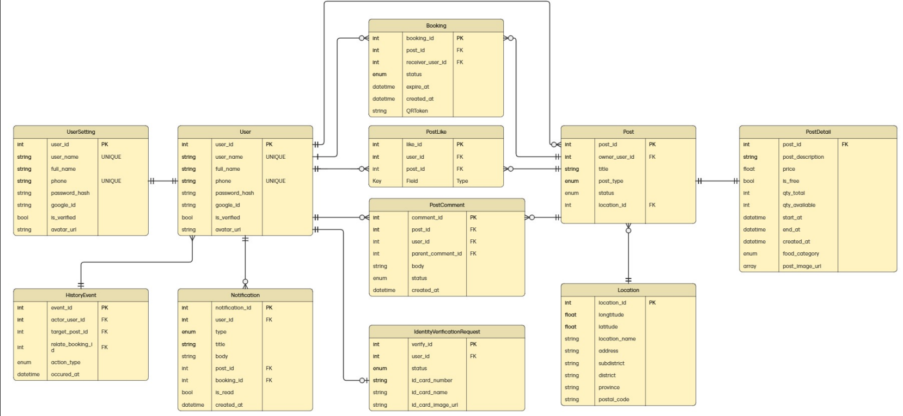

The delivered screens cover the donation feed, a post detail with its pickup window and location, and the saved-items view. Sequence diagrams for queue booking and user verification are in the [course README](3S1/PSPD/).

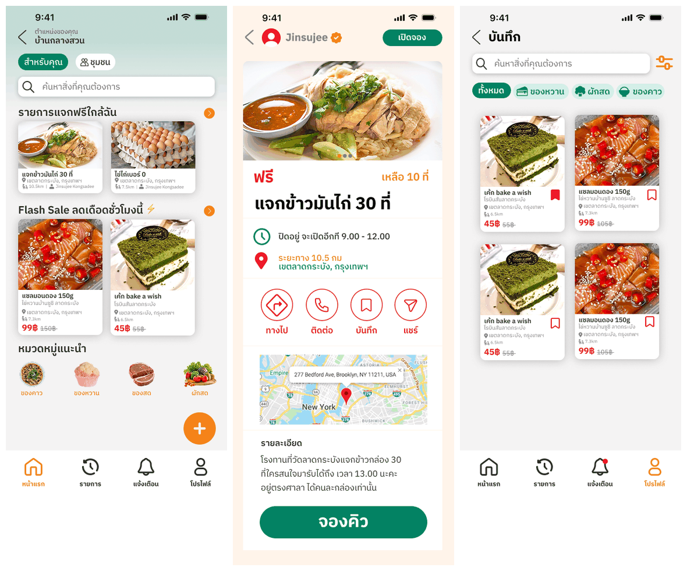

### Border surveillance detection — 01076016 Computer Engineering Project Preparation

A pre-project studying detection of suspicious vehicles and objects, including camouflaged targets that ordinary detectors miss. The work pairs a roadside-camera detection and tracking model with aerial footage captured for the camouflage case.

Detection and tracking assigns a persistent ID and a colour-and-type label to each vehicle:

[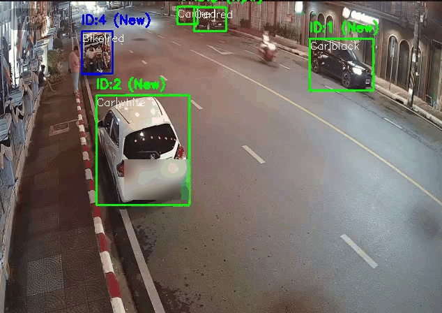](assets/cepp-vehicle-tracking.mp4)

The aerial case is the harder one — a vehicle parked under tree cover, which is what motivated the camouflage-detection direction:

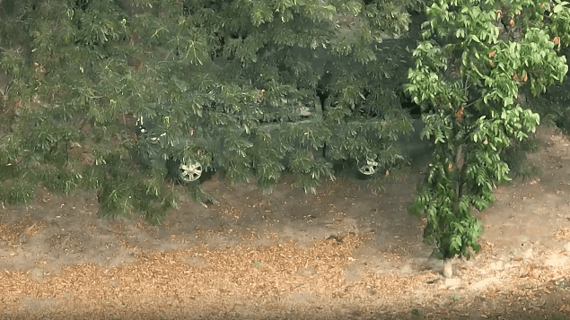

The registration plate in the tracking footage is blurred. Source and datasets for this project are not included in the archive.

### PlanGo - User Experience and User Interface Design

An interface-design project centered on travel-package management, bookings, revenue, ratings, and dashboard reporting. The work is a redesign, so the two dashboards below are the clearest summary of it.

Before — the original TripTalk dashboard:

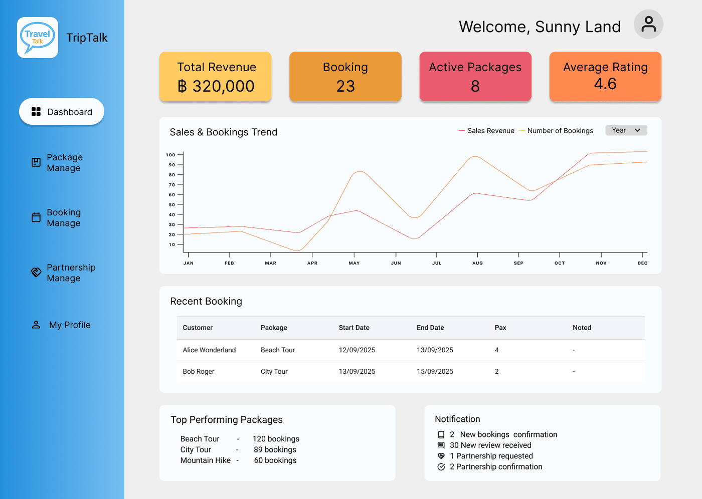

After — the PlanGo redesign, with filterable trend reporting, richer booking records, and per-package conversion:

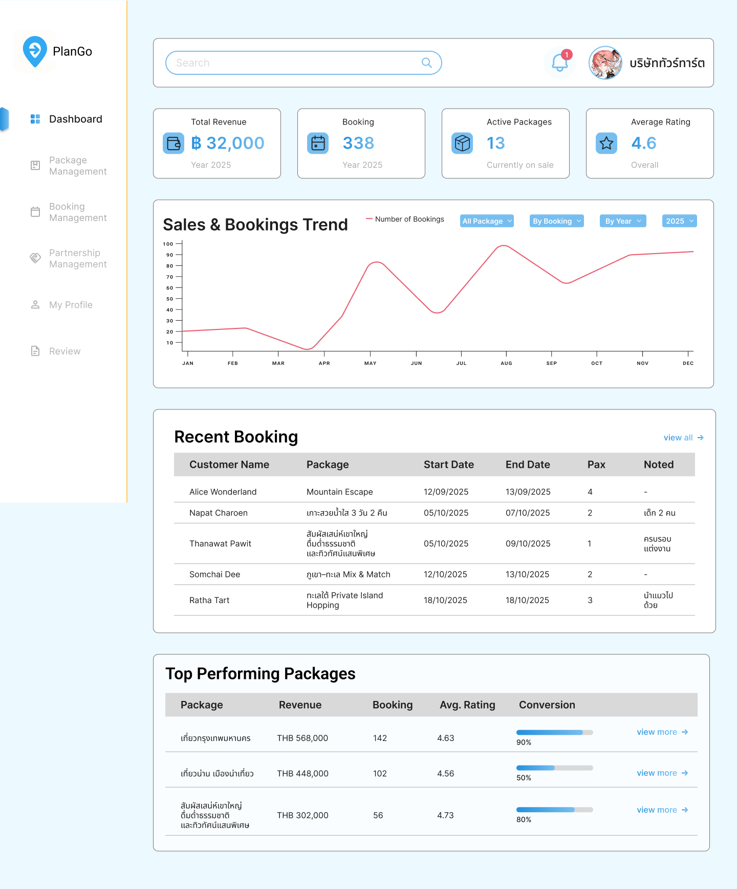

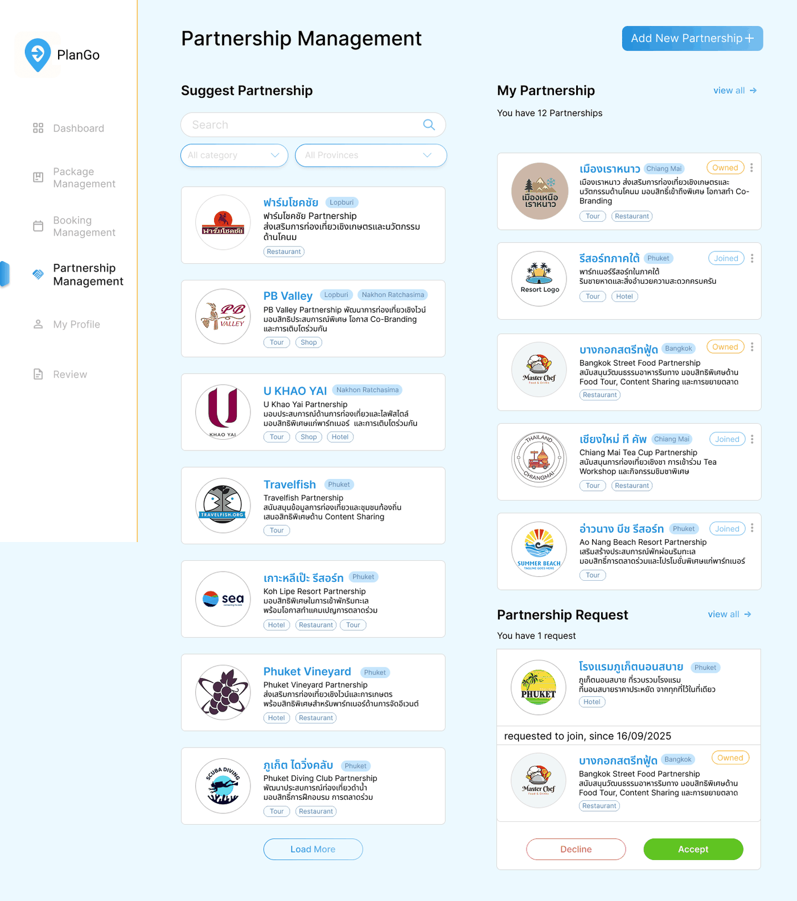

### Image and Multimedia Processing

MATLAB experiments cover block matching, motion estimation, and DCT-related processing in [`3S2/Multimedia`](3S2/Multimedia). Exhaustive block matching predicts a frame from its neighbour and produces the motion field that explains the prediction:

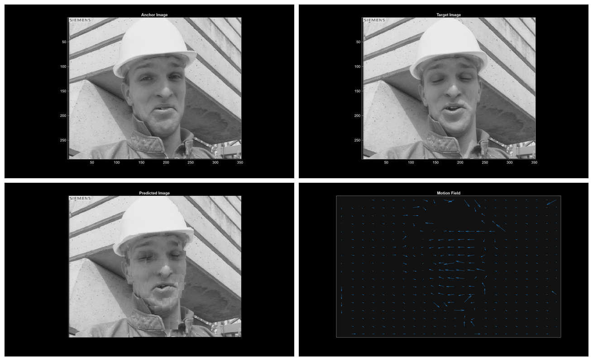

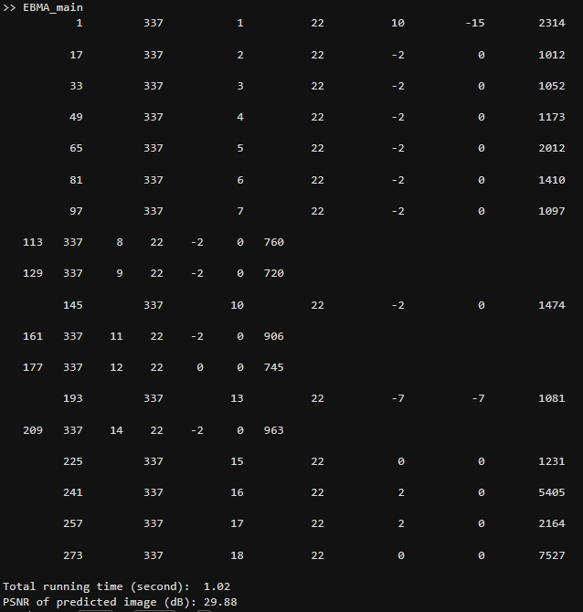

### Hardware and laboratory work

Arduino and STM32 coursework produced working hardware. Each image below links to a short demonstration clip.

[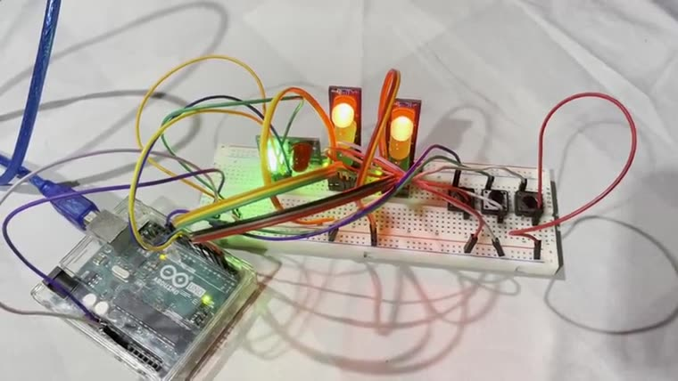](assets/ice-traffic-light-demo.mp4)

[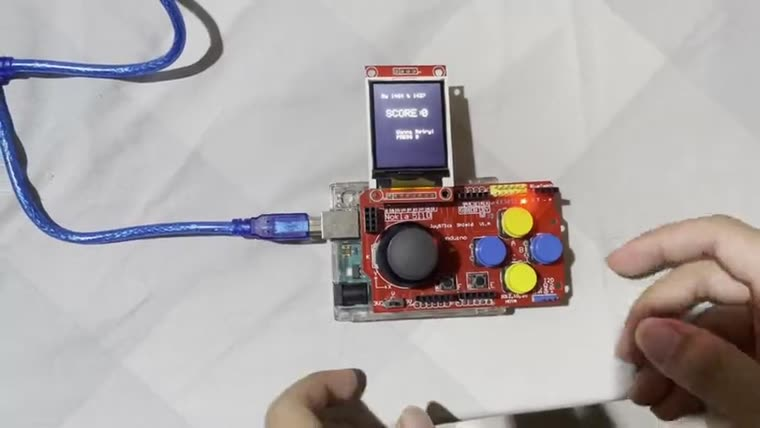](assets/ice-shooter-demo.mp4)

The microcontroller final project was open-ended — build anything the board can drive. The result is a wire-controlled gel-blaster tank: independent hub motors give tank-style steering, a two-axis turret aims a motor-driven gel launcher fed from the hopper, and an ultrasonic sensor provides radar-style ranging.

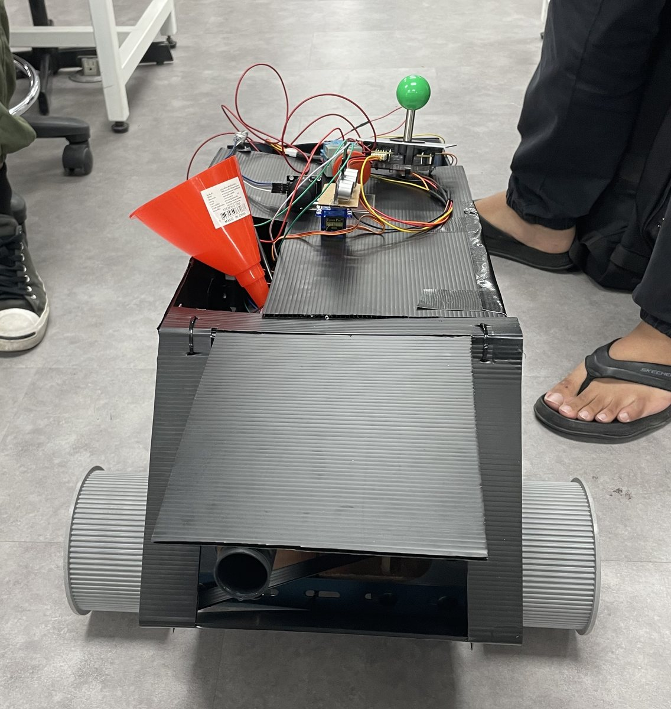

The component build-up and the full control layout are in [`3S1/Microcontroller`](3S1/Microcontroller).

### Project 1 - Expression-guided person segmentation

The current project investigates a pipeline that combines an RGB frame with a natural-language expression to produce a pixel-level person mask, including an explicit empty-mask result when no person matches. The project notes describe dataset decisions, evaluation protocol, verification, model comparisons, and runtime experiments.

- [Research notes](4S1/Project1/docs/research-and-roadmap.md)
- [Project scripts](4S1/Project1/code/scripts)
- [Research portal source](4S1/Project1/code/webapp)
- [Framework figure](assets/project1-research-framework.png)

## Browse or run

```bash
git clone https://github.com/RathaTart/KMITL-CE62.git
cd KMITL-CE62
```

Begin with a semester README, then the relevant course README. There is no repository-wide build: notebooks, hardware sketches, standalone exercises, and web services have different prerequisites. Datasets, helper libraries, hardware configurations, and model weights may need to be supplied separately.

## Course mapping notes

- Folder placement preserves the original archive; academic placement follows the transcript.
- FoodBridge is **01076035 Software Development Process in Practice**, despite its `3S1/PSPD` location.
- `1S2/42` is **90642111 Fun with Coding**, recorded in Year 1, Semester 3.
- `1S1/ProFund` covers **01076103 Programming Fundamental** and **01076104 Programming Project**.
- The dropped Image course has been removed at the owner's request.
- The [course map](COURSE_MAP.md) links only existing public material and clearly identifies shared archives and related artifacts.

## Scope and attribution

This is a curated academic portfolio, not a complete computer backup. Private records, credentials, large datasets, and generated environments are not included. Original licenses and attribution remain authoritative for third-party components. Historical samples demonstrate coursework and are not a blanket claim of production readiness.
