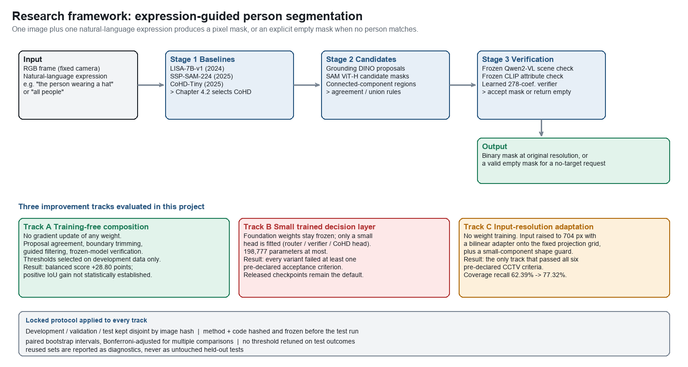

# KMITL CE62

> A curated Computer Engineering study archive from King Mongkut's Institute of Technology Ladkrabang (KMITL).

This repository collects selected course projects, laboratories, source code, research notes, design work, and demonstrations from my KMITL Computer Engineering studies. It is organized by semester so that the learning path is easy to browse, while keeping generated environments, large datasets, model weights, private records, and course-only materials out of the public history.



## At a glance

| | |
|---|---|
| Program | Bachelor of Engineering in Computer Engineering |
| Institution | King Mongkut's Institute of Technology Ladkrabang (KMITL) |
| Coverage | Semester 1, Year 1 through Project 1 |
| Main tools | C/C++, Python, Go, JavaScript, MATLAB, Arduino, STM32, SQL |
| Repository style | Course-by-course archive inspired by [TKishioru/KMITL.CE](https://github.com/TKishioru/KMITL.CE) |

The accompanying unofficial transcript was used as a private reference for the course map. It is not included in this repository; no student ID, date of birth, or grade-by-grade transcript is published here.

## Featured work

### Asteroid Invader - Programming Fundamentals

A console-game project that grew from C/C++ movement, collision, projectile, scoring, and menu experiments. The final source was not present in the original exported `ProFund/Game` folder, so this archive preserves the closest local source prototypes together with the final demonstration media.

- [GameText.c](1S1/C%20C%2B%2B/Com%20Funda/GameText.c) - ship, bullets, stars, and score
- [Game.cpp](1S1/C%20C%2B%2B/Com%20Funda/Game.cpp) - earlier movement and projectile prototype
- [Menu screenshot](assets/asteroid-invader-menu.png)
- [Final demo video](assets/asteroid-invader-demo.mp4)

### FoodBridge - Software Development / Project Work

A Go backend project with authentication, users, posts, bookings, comments, notifications, verification, and location-related domains. The included ER diagram shows the relational model and the source is grouped under [`3S1/PSPD/FoodBridge`](3S1/PSPD/FoodBridge).


### PlanGo - User Experience and User Interface Design

An interface-design project centered on travel-package management, bookings, revenue, ratings, and dashboard reporting. A representative dashboard is included in [`assets/plango-dashboard.png`](assets/plango-dashboard.png).


### Image and Multimedia Processing

The archive includes image-processing notebooks and MATLAB experiments covering photo mosaics, KNN-style workflows, block matching, motion estimation, and DCT-related processing. The EBMA result below is a compact example of the work in [`3S2/Multimedia`](3S2/Multimedia).


### Project 1 - Expression-guided person segmentation

The current project investigates a pipeline that combines an RGB frame with a natural-language expression to produce a pixel-level person mask, including an explicit empty-mask result when no person matches. The project notes describe dataset decisions, evaluation protocol, verification, model comparisons, and runtime experiments.

- [Research notes](4S1/Project1/docs/research-and-roadmap.md)
- [Project scripts](4S1/Project1/code/scripts)
- [Research portal source](4S1/Project1/code/webapp)
- [Framework figure](assets/project1-research-framework.png)

## Academic path

The complete sanitized course list and local-folder mapping are in [COURSE_MAP.md](COURSE_MAP.md). The short version is:

<details>
<summary><b>Year 1 - foundations and programming</b></summary>

- Programming Fundamentals and Programming Project
- Introduction to Computer Engineering
- Calculus 1 and 2, Discrete Structure
- Object-Oriented Programming and project work
- Circuits and Electronics with practice
- Human-Computer Interaction
- Board-game technologies, application software, digital storytelling, and entrepreneurship foundations

</details>

<details>
<summary><b>Year 2 - systems, data, and applications</b></summary>

- Data structures and project work
- Digital systems and practice
- Computer organization and architecture
- Computer networks and practice
- Web application development and project work
- Differential equations and linear algebra
- Image processing and applied data-analysis projects

</details>

<details>
<summary><b>Year 3 - professional computer engineering</b></summary>

- Operating Systems
- Microcontroller Application and Development with project work
- Software Development Process and practice
- UX/UI design and project work
- Software project development
- Internetworking Standards and Technologies
- Cloud Architecture
- Database Systems
- Multimedia Systems
- Artificial Intelligence
- Computer Engineering Project Preparation

</details>

<details>
<summary><b>Year 4 - project work</b></summary>

- Computer Engineering Project 1
- English for Work Preparation

</details>

## Repository layout

```text
KMITL-CE62/
├── 1S1/   Year 1, semester 1: C/C++, electronics, fundamentals
├── 1S2/   Year 1, semester 2: OOP, HCI, circuits, web and board games
├── 2S1/   Year 2, semester 1: data structures, digital, image and ML work
├── 2S2/   Year 2, semester 2: networks, organization and web applications
├── 3S1/   Year 3, semester 1: OS, microcontrollers, software projects and UX/UI
├── 3S2/   Year 3, semester 2: AI, cloud, networking, multimedia and software process
├── 4S1/   Project 1: research notes, scripts and a lightweight web portal
├── assets/ Selected screenshots, diagrams, an infographic-style framework, and one demo
├── COURSE_MAP.md
└── MEDIA.md
```

## Quick start

Clone the archive and browse by semester:

```bash
git clone https://github.com/RathaTart/KMITL-CE62.git
cd KMITL-CE62
```

Most folders are self-contained exercises or course submissions. For notebooks, open the `.ipynb` file with Jupyter. For C/C++, compile the individual source file with the toolchain expected by that exercise. For Go, start in the relevant project folder and read its `README.md`, `go.mod`, and configuration files before running it. For Project 1, begin with the Markdown notes in `4S1/Project1/docs`.

The archive intentionally does not include local virtual environments, large datasets, pretrained weights, build outputs, or machine-specific dependency caches. Recreate those from the project notes and dependency manifests when needed.

FoodBridge includes a checked-in `.env.example` with development-only placeholders. Use real local secrets through environment variables and never commit a real `.env` file.

## Visual guide

The selected visual material is indexed in [MEDIA.md](MEDIA.md). The images are included because they make the work easier to understand at a glance; they are not intended to replace the source or technical notes.

## Public-sharing boundary

This is a curated public study portfolio, not a full backup of the `Desktop/KMITL` directory. The following are intentionally omitted:

- the unofficial transcript and other grade records;
- internship, job-application, CV, and personal documents;
- generated IDE folders, virtual environments, dependency caches, and build outputs;
- raw datasets, model weights, archives, VM images, and oversized recordings;
- materials that are useful locally but do not explain the software work.

Some projects depend on third-party libraries or research models. Their original licenses and attribution notices remain the authority for those components.
